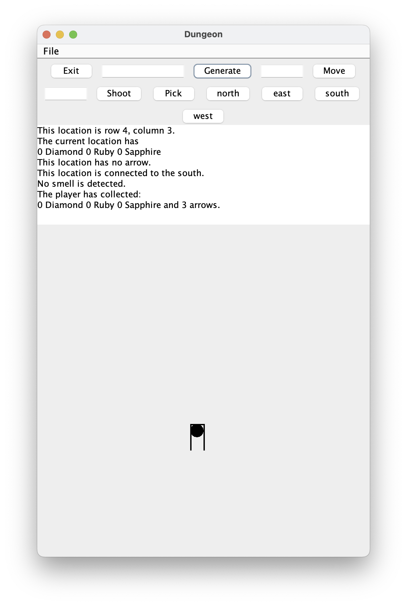
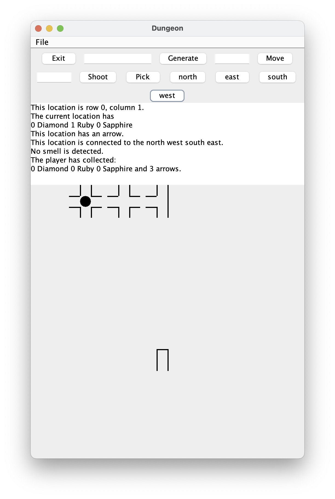
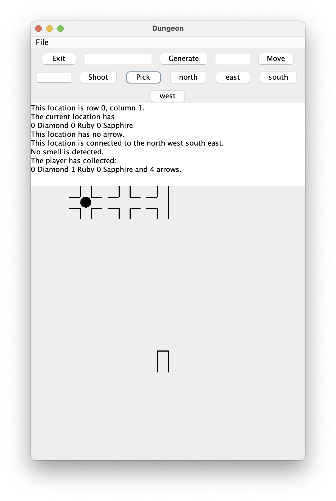
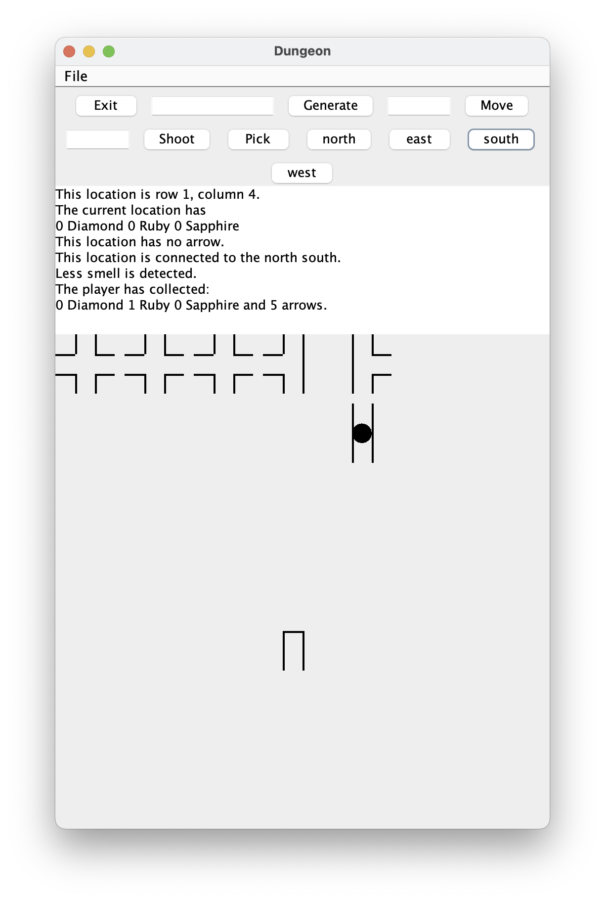
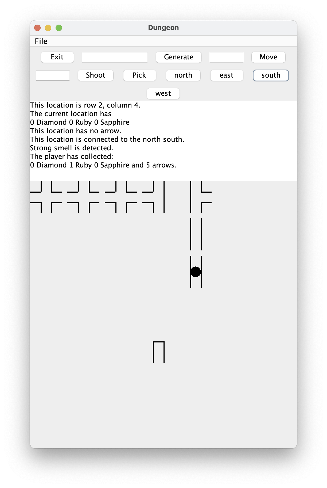
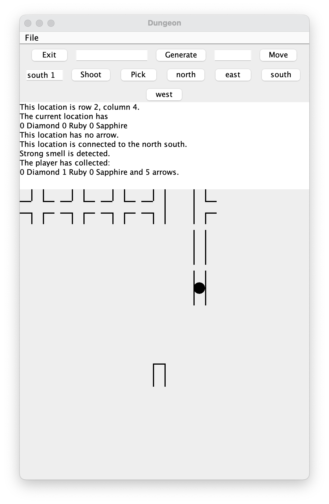
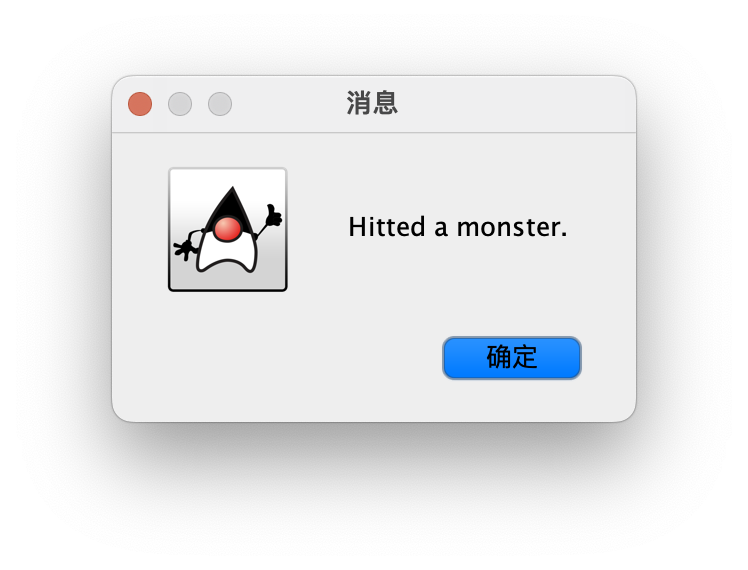

# DungeonGame
This is the final project of CS5010 at Northeastern University.

It is a dungeon game that contains randomly generated dungeon, treasures, arrows and monsters. The start and end are also randomly generated and you can specify the level of interconnectivity when generating the dungeon.

Following shows a few screenshots of running the game, and more details can be found in `res/README`.

Generating the dungeon.

After a few moves, player picked up no treasure and no arrow.

Player picked up one ruby and one arrow.

A few moves later, player find less smell of a monster. This indicates that there's a monster two distance away from the player.

Move one more step. The strong smell means there's a monster of distance one away from the player.

The player shot an arrow at direction south with distance one.

Notification showing that a monster is hitted.

